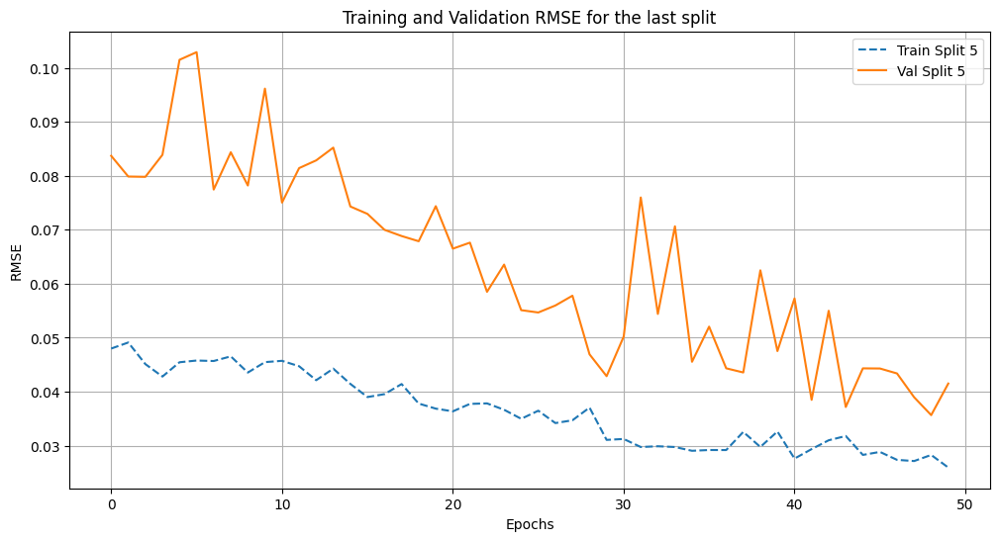
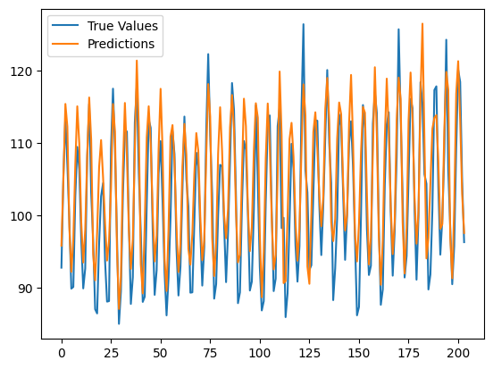
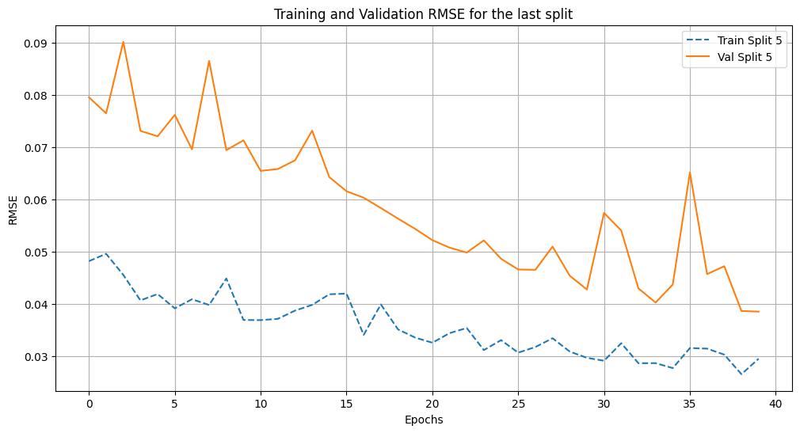
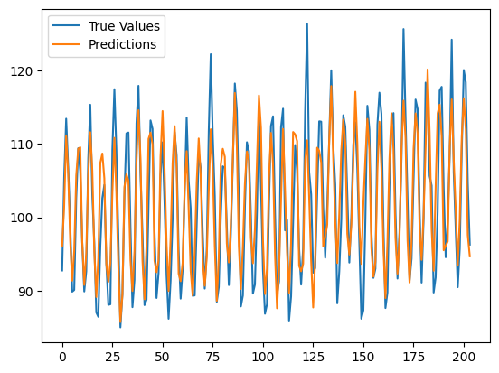

# 
<strong>Technical Assignment</strong> 
 

  <a href="##introduction">Introduction</a> |  
  <a href="#models">Models </a> | 
  <a href="#performance-evaluation">Performance Evaluation</a> | 

## Introduction

This repository contains an analysis tool for forecasting the monthly industrial production of Electric and Gas Utilities in the United States. This sector is a significant contributor to fluctuations in national output over the course of the business cycle. By examining the industrial production (IP) index, which measures the real output of establishments located in the U.S. (excluding territories), we gain insights into structural developments within the economy. This forecasting project aims to leverage historical production data to predict future trends.

For more detailed information, please refer to the explanatory notes issued by the Board of Governors.

## Code Architecture

The project is organized into the following Jupyter notebooks, chosen for their ability to visualize and interpret results efficiently:

- **data_preparation.ipynb**: This notebook contains analysis and methods for preprocessing data, preparing it for model training.
- **model_selection.ipynb**: This notebook covers the model selection process, where models are trained, compared, and evaluated.

For the forecasting task, we opted to use **LSTM (Stacked LSTM)** and **CNN-LSTM** models, both of which are well-suited for time series prediction tasks.

## Results

Below are some of the results produced by the models:

  
  
  
  

### Model Performance Metrics

| Metric   | Stacked LSTM | CNN-LSTM |
|----------|--------------|----------|
| MAE      | 3.17     | 5.21  |
| RMSE     | 4.16      | 6.46  |

## Database Management

[Details about database management, if applicable, to be added here.]
